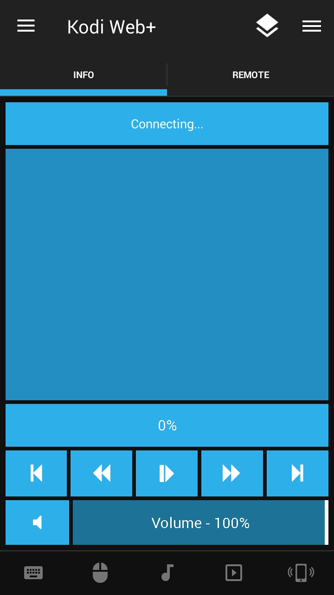
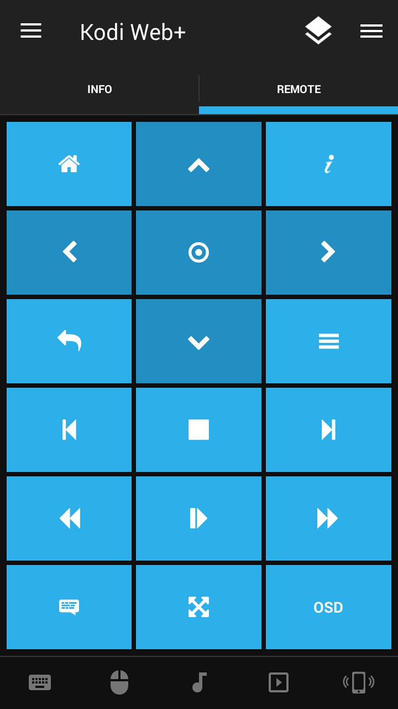

# unifiedremote-kodiplus
Improved web interface remote for [Kodi](https://kodi.tv/). Used the [Kodi Web remote](https://github.com/unifiedremote/Remotes/tree/master/Main/Kodi%20Web) as base.

## Features
* Navigate up/left/right/down, and select current item
* Toggle home, information, back, and context menu
* Toggle play/pause and stop
* Rewind/fast forward, and play next/previous item
* Change volume increment/decrement in the settings
* Raise/lower volume using hardware volume keys
* Mute volume or change value manually using slider
* Toggle subtitles, fullscreen, and OSD
* Show currently playing media information
* Change current position via slider

## Screenshots

## Requirements
* [Unified Remote](https://www.unifiedremote.com)
* [Kodi](https://kodi.tv/)

## Installation
Follow the instructions at the [Unified Remote tutorials](https://www.unifiedremote.com/tutorials/how-to-install-a-custom-remote).

## License
For more information, please refer to <[http://unlicense.org](http://unlicense.org)>.

## Todo
* Add Playlist tab
